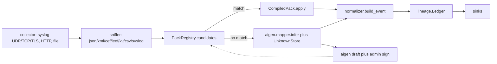

# Codebase guide

This is a map of the repository. After reading it you should be able to find the function that handles a given step, and follow one log line from the wire to the dashboard.

Package version: `0.1.0` (`ulpf/__init__.py`). Python `>=3.11`. Entry point: `ulpf = ulpf.cli:main`.

## Directory layout

```
ulpf/                  Python package (the pipeline)
  collector/           syslog UDP/TCP/TLS, file tail, batcher
  extractors/          json, xml, csv, kv, cef, leef, grok/regex, syslog
  sniffer/             guess wire format
  packs/               YAML schema, compiler, registry, signed library
    library/           15 vendor packs + .sig files
    trusted/           builtin.pub
  normalizer/          OCSF 1.3 coerce/validate + envelope
  lineage/             Merkle tree + signed hash-chain ledger
  aigen/               unknown clustering, Drain3, mapper, LLM, drafts
  validator/           Schema Fidelity replay
  sinks/               SQLite, JSONL, Parquet, ClickHouse, Splunk, Elastic, CEF
  api.py, auth.py, audit.py, cli.py, config.py, crypto.py, pipeline.py,
  runtime.py, security.py, bus.py
ui/                    dashboard (index.html, app.js, style.css)
samples/               perimeter vendor logs + unknown (Sophos, MikroTik)
tests/                 10 pytest functions
tools/                 OCSF schema compiler, fidelity debugger
deploy/                Dockerfile, Compose, secrets script, air-gap scripts
docs/                  this folder
data/                  runtime state, created on first run (gitignored)
third_party/           gitignored datasets and OCSF schema source
```

## How Runtime is wired

`ulpf/runtime.py` is the process-wide object graph. The CLI (`serve`, `ingest`, `bench`, `worker`) and the FastAPI app all construct one `Runtime(settings)`:

| Attribute | Type | Source |
|---|---|---|
| `settings` | `Settings` | `ulpf/config.py` (`ULPF_*` env) |
| `auth` | `TokenStore` | `ulpf/auth.py` |
| `audit` | `AuditLog` | `ulpf/audit.py` → `data/audit.jsonl` |
| `ledger` | `Ledger` | `ulpf/lineage/ledger.py` → `data/ledger.db` |
| `sinks` | list | `ulpf/sinks.build_sinks` |
| `store` | `SQLiteStore` or None | looked up by class name |
| `unknown` | `UnknownStore` | in-memory clusters of unmatched lines |
| `registry` | `PackRegistry` | loads `packs_dir` + `approved_dir` |
| `pipeline` | `Pipeline` | sniffer + packs + envelope |
| `limiter` | `TokenBucket` | per-token / per-peer rate limit |
| `syslog` | `SyslogOptions` or None | set only when `ulpf serve --syslog` |

`Runtime.ingest(lines, source)` wraps each line in a `RawEvent` and calls `Pipeline.process`. `Runtime.preview` normalizes without the ledger or sinks (used by `POST /v1/preview`).



## Path of one FortiGate UDP syslog line

Function names in call order:

1. `SyslogServer.accept` (`ulpf/collector/syslog.py`) — `_UDP.datagram_received` hands the datagram here. Frame size is checked, `TokenBucket.allow(peer)` runs, trailing `\r\n\x00` is stripped, a `RawEvent` is queued.
2. `AsyncBatcher.run` (`ulpf/collector/batcher.py`) — up to `batch_size` events or 0.2 s, then `asyncio.to_thread(Pipeline.process, batch)`.
3. `Pipeline.process` → `_process` → `Pipeline.normalize` (`ulpf/pipeline.py`).
4. `check_line` (`ulpf/security.py`) — byte cap, decode, NUL replacement.
5. `sniff` (`ulpf/sniffer/__init__.py`) — PRI / syslog timestamp → `extract_syslog` → payload classified as `kv`. Result: `Sniff("kv", "syslog")`.
6. `PackRegistry.candidates(raw, sn, source)` (`ulpf/packs/loader.py`) — packs whose `match` succeeds, sorted by `priority` descending. FortiGate matches `formats: [kv]` plus `contains: ["devid=", "logid="]`.
7. `CompiledPack.apply` (`ulpf/packs/engine.py`):
   - `extract()` runs parse stages: `extract_syslog`, then `extract_kv` on `fields["message"]`.
   - First `CompiledClass` whose `when` matches wins (`type=traffic` → `network_activity`).
   - Mapping specs resolve (common mapping + class mapping). Unknown OCSF paths are skipped. `ocsf.coerce` types the value.
8. `build_event` (`ulpf/normalizer/envelope.py`) — OCSF fields, captions, `unmapped`, `raw_data`, `ulpf.*`, `ocsf.validate`, `sha256_hex`.
9. If no pack applied: `_fallback` runs sniffer-chosen extractors, `mapper.infer`, `build_event`, and `UnknownStore.add`.
10. `Stats.record`.
11. `Ledger.append` (`ulpf/lineage/ledger.py`) — when the batch fills, `_seal`: `canonical_digest`, `merkle.leaf_hash`, `merkle.root`, chain hash, `crypto.sign`. Writes `ulpf.batch_id`, `ulpf.merkle_leaf`, `ulpf.norm_sha256`.
12. Each `sink.write`. Sink exceptions are counted, not raised. A ledger exception *is* raised and the batch is not sunk.

HTTP ingest is the same from step 3: `POST /v1/ingest` → `Runtime.ingest`. CLI `ulpf ingest FILE` uses `collector.filetail.read_file`. Kafka `ulpf worker` calls `pipeline.process` and publishes to `ulpf.normalized` (nothing currently publishes to `ulpf.raw`; see [KNOWN_ISSUES.md](KNOWN_ISSUES.md)).

## Module map

### Config and security

- `ulpf/config.py` — `Settings` dataclass. Every field is `ULPF_<NAME>`. `secret_from_file` reads `ULPF_<NAME>_FILE` then `ULPF_<NAME>`. See [CONFIGURATION.md](CONFIGURATION.md).
- `ulpf/security.py` — `safe_regex` (RE2, falls back to `re`), `safe_yaml_load`, `check_line`, `safe_json_loads` / `json_depth`, `TokenBucket`, `InputRejected`.
- `ulpf/crypto.py` — Ed25519 generate / load / sign / verify. Keys are PKCS8 PEM (private, mode 0600) and SubjectPublicKeyInfo PEM (public).

### Collectors

- `ulpf/collector/syslog.py` — UDP, TCP (LF or RFC 6587 octet counting), TLS 1.2+ with optional mTLS. Max 512 TCP connections, 300 s idle timeout.
- `ulpf/collector/batcher.py` — `AsyncBatcher(handler, max_batch=256, max_delay=0.2, max_queue=100_000)`. Drops when the queue is full (`dropped` is not exposed).
- `ulpf/collector/filetail.py` — `read_file` (used by CLI ingest and tests). `follow` exists and is unused.

### Sniffer and extractors

- `ulpf/sniffer/__init__.py` — `sniff(raw) -> Sniff`. Formats: `json`, `xml`, `cef`, `leef`, `kv`, `csv`, `text`/`syslog`.
- `ulpf/extractors/` — each module exports `(text, opts) -> dict`. Registry names: `json`, `xml`, `csv`, `kv`, `grok`, `regex`, `cef`, `leef`, `syslog`. XML goes through `defusedxml` with `forbid_dtd=True`. JSON is depth-limited. Regex/Grok compile through `safe_regex`.

### Packs

- `ulpf/packs/schema.py` — JSON Schema, `validate_pack`.
- `ulpf/packs/engine.py` — `compile_pack`, `CompiledPack.matches/extract/apply`.
- `ulpf/packs/loader.py` — `PackRegistry`, signature verify/sign, trusted keys in `ulpf/packs/trusted/*.pub` plus `keys_dir/pack_signers/*.pub`.
- Library: see [PACK_AUTHORING.md](PACK_AUTHORING.md).

### Normalizer

- `ulpf/normalizer/ocsf.py` — vendored schema access, `coerce`, `parse_timestamp`, `set_path`/`get_path`, `validate`.
- `ulpf/normalizer/envelope.py` — `build_event`.
- `ulpf/normalizer/ocsf_schema.json` — compiled OCSF 1.3.0 (71 classes, 124 objects). Rebuild with `tools/build_ocsf_schema.py`.

### Lineage and sinks

- `ulpf/lineage/merkle.py` — leaf / node / proof.
- `ulpf/lineage/ledger.py` — SQLite append-only ledger.
- `ulpf/sinks/` — `build_sinks` accepts `sqlite`, `jsonl`, `parquet`, `clickhouse`, `splunk`, `elastic`, `cef`. Dashboard requires `sqlite`.

### AI generator and fidelity

- `ulpf/aigen/` — see [AI_PARSER_GENERATOR.md](AI_PARSER_GENERATOR.md).
- `ulpf/validator/` — see [FIDELITY_VALIDATOR.md](FIDELITY_VALIDATOR.md). Pipeline fallback imports `ulpf.aigen.mapper` even when you are not onboarding a vendor.

### API, CLI, UI

- `ulpf/api.py` — FastAPI wrapped in `SecurityHeaders(BodyLimit(app))`. See [API_AND_CLI.md](API_AND_CLI.md).
- `ulpf/auth.py` — hashed tokens, roles.
- `ulpf/audit.py` — hash-chained JSONL.
- `ulpf/cli.py` — `serve`, `worker`, `ingest`, `fidelity`, `bench`.
- `ulpf/bus.py` — Kafka worker (consumer only in practice).
- `ui/` — six-tab dashboard, no frameworks, no `innerHTML` (CSP).

### Tests, tools, deploy

- `tests/` — 10 functions covering syslog framing, ingest auth, lineage after tamper, Sophos synthesis, signed packs. See [DEVELOPMENT.md](DEVELOPMENT.md).
- `tools/build_ocsf_schema.py` — compiles `third_party/ocsf-schema` into `ocsf_schema.json`.
- `tools/fidelity_debug.py` — single-dataset field-resolution dump. Must be run from the repo root. Crashes on JSON stage rules (see known issues).
- `deploy/` — container, Compose profiles, `make-secrets.sh`, air-gap save/load.

## What not to look for

There are no `TODO`/`FIXME` markers in `ulpf/`. Empty `__init__.py` files are package markers, not unfinished modules. `ulpf/validator/__init__.py` is empty; everything else has a one-line docstring.
